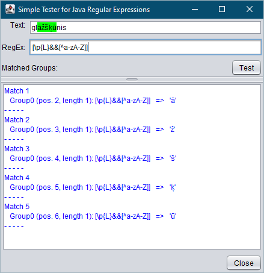

# simple-java-regex-tester

A tool for testing Java regular expressions. 
Matches are higlighted in green at the top pane. Match positions as well as matched regex groups are displayed in the bottom pane.

_NOTE: The source contains a GUI form created using NetBeans GUI Builder._

### Open from commandline:
`java -cp * com.tilde.simpleregextester.UserForm`

OR

`java -jar SimpleRegexTester-1.0.jar`

---
### Application window example

